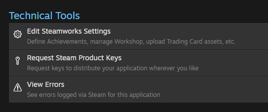

# unity3D整合steamworks并上传

主要参考依据是value官方的steampipe方式：
<https://partner.steamgames.com/doc/sdk/uploading#Creating_Depot_Build_Config_Files>

## 1. 注册账号及申请appid

在steamwork注册账号，花100刀购买额度，这一步没啥好说的，不过需要注册单位等

## 2. 导入steamworks.net插件

安装 Steamwork.NET(这里要感谢外国小哥)

1. 下载 [.unitypackage Stable (12.0.0)](https://github.com/rlabrecque/Steamworks.NET/) 或者从 Github 克隆
2. 导入下载的所有文件到项目 Assets/ 目录下.
3. 打开unity项目，会自动生成steam_appid.txt到项目的主目录下.
4. 打开 steam_appid.txt 并将 480 修改为自己的 AppId.
5. 更改脚本 SteamManager.cs 找到  SteamAPI.RestartAppIfNecessary(AppId_t.Invalid)将AppId_t.Invalid替换成(AppId_t)480" 或者 "new AppId_t(480), 480改成自己的APP ID如图：

    ``` csharp
    if (SteamAPI.RestartAppIfNecessary((AppId_t)1081910))
    {
        Application.Quit();
        return;
    }
    ```

    **注意**：导入时，项目目录中实际存在2个steam_appid.txt，都需要进行修改，unity内开发时需注意添加（可通过重新导入.unitypackage进行)，主要是为了避开通过steam启动，打包时注意删除

6. Steam根据提示修改重启unity，保证 steam_appid.txt 已生效.
7. 重启unity，保证 steam_appid.txt 已生效.
8. 安装sdk完成.

具体使用范例可以参考其[教程](http://steamworks.github.io/gettingstarted/)。

**说明**：通过SteamAPI.RestartAppIfNecessary即可判断玩家是否通过steam启动，和玩家的游戏列表中是否有此游戏，具体可以参考链接[Initialization and Shutdown](https://partner.steamgames.com/doc/sdk/api#SteamAPI_RestartAppIfNecessary)

## 3. 上传前Steamwork的准备工作

### 1. 创建Depot

1. 由Technical Tools ->SteamworksSettings进入编辑页面


2. 进入Depot页面

一般有默认的一个depot，其id是appid加1,我们可以之接利用它作为我们的depot进行之后的一系列操作，当然也可以通过页面中的add new depot新建一个depot，对当前的depot进行设置后即可使用。
也可以在depot页面中修改支持的语言


### 2. 设置Installation


通过设置add new launch option设置启动方式，通过修改executable的内容即可设置启动执行程序

### 3. publish


通过点击prepare for publishing即可出现publish to steam，然后输入steamworks即可完成发布，此时就可以进自己的库中查看（不一定，可能还是得上传后才行）

## 4. 打包及DRM

删除工程内（包括项目根目录）的两个steam_appid.txt文件后即可按unity正常流程打包。下面对DRM流程进行说明。


1. 进入DRM标签页
2. 点击选择文件，选择unity打包后生成的.exe文件
3. 点击upload
4. upload完成后，点击新出现的module，点击即可下载
5. 将下载好的文件拷贝回原先.exe文件处
6. 删除原先的.exe文件，并将所下载文件的名称改为原.exe文件名

## 5. 上传

打包需要用到Steamworks SDK v1.44，登录下载后进行解压，首先进入目录\steamworks_sdk_144\sdk\tools\ContentBuilder，之后所有步骤都会在该文件夹及其子文件夹进行

### 1. 向content添加build内容

untiy中去掉所有steam_appid_txt后进行打包，将内容复制到向ContentBuilder\content中，可以直接复制，或者先新建windows_content文件夹后放入，只是会影响之后depot_build_1081911.vbf中的一个路径。

### 2. 修改script

1. 修改文件名
进入ContentBuilder\script中，修改两个脚本名称分别如图所示。其中app_build后跟app id，depot_build后跟deopt id，文件用notepad打开。

    

2. 修改app_build
app_build文件修改主要修改"appid"和"depots"内的内容，"desc"后可添加你的说明内容。

    ```vdf
    "appbuild"
    {
        "appid" "1081910"
        "desc" "This is a release build with lang could be changed" // description for this build
        "buildoutput" "..\output\" // build output folder for .log, .csm & .csd files, relative to location of this file
        "contentroot" "..\content\" // root content folder, relative to location of this file
        "setlive" "" // branch to set live after successful build, non if empty
        "preview" "0" // to enable preview builds
        "local" "" // set to flie path of local content server

        "depots"
        {
            "1081911" "depot_build_1081911.vdf"
        }
    }
    ```

3. 修改depot_build
depot_build中主要修改的内容是"DepotID","ContentRoot"和"LocalPath"，其中"ContentRoot"和"LocalPath"需要与之前放入content的内容路径对应

    ```vdf
    "DepotBuildConfig"
    {
        // Set your assigned depot ID here
        "DepotID" "1081911"

        // Set a root for all content.
        // All relative paths specified below (LocalPath in FileMapping entries, and FileExclusion paths)
        // will be resolved relative to this root.
        // If you don't define ContentRoot, then it will be assumed to be
        // the location of this script file, which probably isn't what you want
        "ContentRoot"    "F:\sdk\steamworks_sdk_144\sdk\tools\ContentBuilder\content"

        // include all files recursivley
    "FileMapping"
    {
        // This can be a full path, or a path relative to ContentRoot
        "LocalPath" ".\windows_content\*"

        // This is a path relative to the install folder of your game
        "DepotPath" "."

        // If LocalPath contains wildcards, setting this means that all
        // matching files within subdirectories of LocalPath will also
        // be included.
        "recursive" "1"
    }

        // but exclude all symbol files  
        // This can be a full path, or a path relative to ContentRoot
    "FileExclusion" "*.pdb"
    }
    ```

### 3. 修改并执行run_build.bat

1. 修改
run_build.bat可在.\ContentBuilder\中找到，需修改的内容分为用户名，密码喝所执行的app_build脚本名称

    ```shell
    builder\steamcmd.exe +login <开发者用户名> <开发者密码> +run_app_build_http ..\scripts\app_build_1081910.vdf
    ```

2. 执行
确认以上步骤完成后即可执行.bat，需要注意的是，运行过程中会提示你输入双重保护验证码，可能是邮箱或手机令牌，输入后等待提示成功即可。

## 5. 建立build并publish

1. 由steam pipe进入build页面


2. 选择刚刚上传的最新版本，点开下拉菜单后选择default，点击preview change
    
    进入新的页面后，会提示与上一版本的差异，确认后即可看到defualt处的build版本
    

3. 进入publish标签页后进行发布即可

至此，我们完成了一个可用版本的发布，重启steam后即可进行下载或更新。