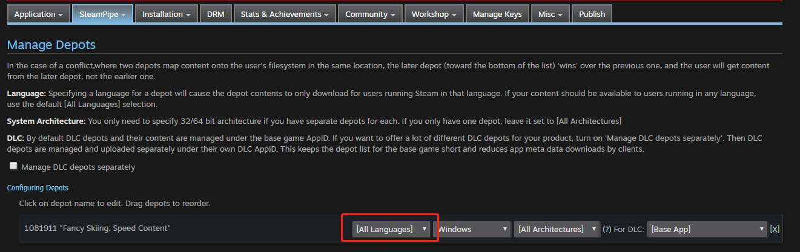
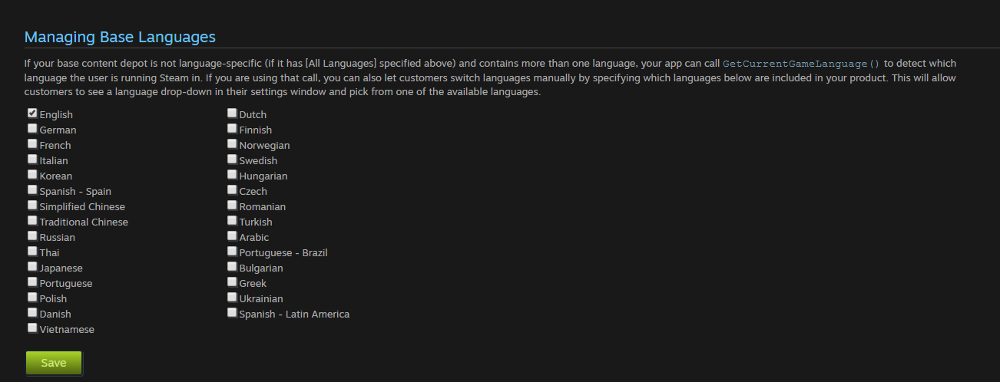
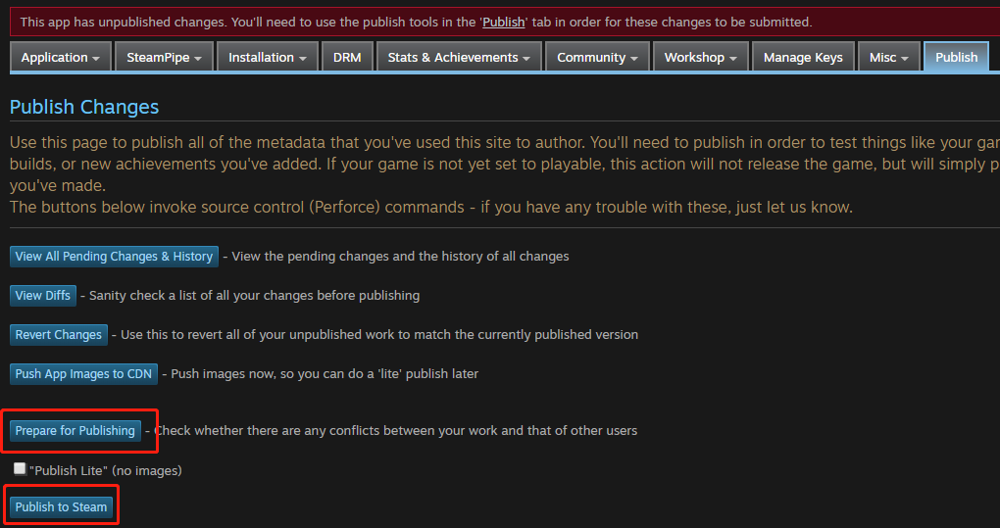

# steampipe游戏语言管理

我们所采用的是将本地化语言内置在游戏中，通过 Steamworks.Steamapps.GetCurrentGameLanguage() 获取所选语言，在进行本地化显示的方案。

## 1. 创建Depot

1. 由Technical Tools ->SteamworksSettings进入编辑页面

    

2. 进入Depot页面

    

    一般有默认的一个depot，其id是appid加1,我们可以之接利用它作为我们的depot进行之后的一系列操作，当然也可以通过页面中的add new depot新建一个depot，对当前的depot进行设置后即可使用。这里我们使用**默认的depot**，并选择为**All Language**。

### 2. 设置语言

由于先锁国区，所以只选择支持英文，点击save即可。

**注意**：如果后续需要支持中文，则在此处勾选中文（简体/繁体），在进行保存和发布。

### 3. publish

可以通过view diffs浏览这次的修改内容。

通过点击prepare for publishing即可出现publish to steam，然后输入steamworks即可完成发布，此时就可以进自己的库中查看（不一定，可能还是得上传后才行）

## 4. 测试方式

**注意**：测试前首先需要删除本地已安装的相应游戏。

1. 在depot中语言设置改为只勾选英文，save后publish
2. 重启steam进行下载，可以发现游戏语言为英文
3. 在depot中语言设置改为勾选英文和简体中文，save后publish
4. 重启steam，启动时会有自动更新，关闭后可以发现语言选项可修改，
5. 此时设置为中文，进入游戏则为中文